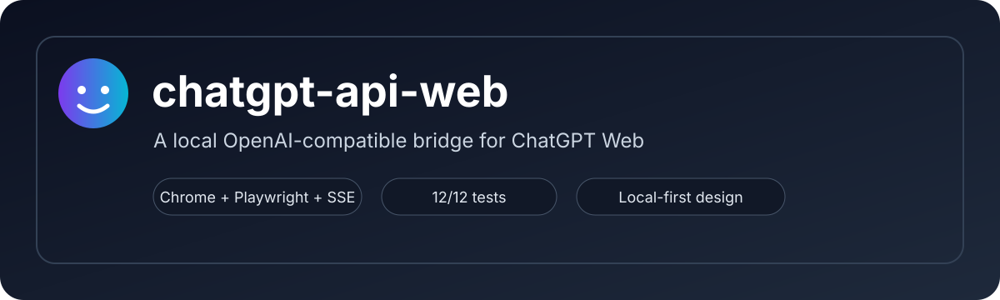
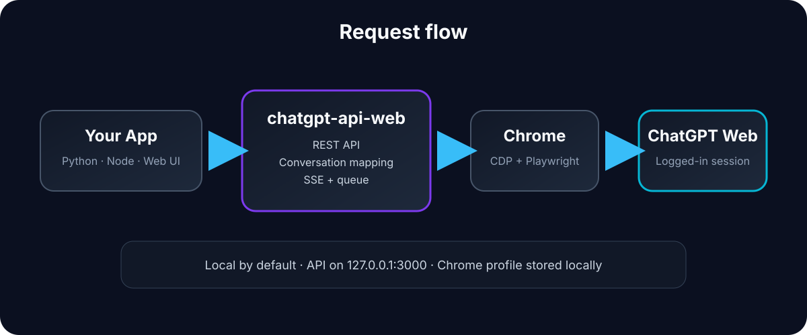

# chatgpt-api-web

<p align="center">
  
</p>

<p align="center">
  <strong>Turn your ChatGPT Web session into a local OpenAI-compatible API.</strong>
</p>

<p align="center">
  Chrome + Playwright + a persistent ChatGPT session + a local REST/SSE API.
</p>

<p align="center">


</p>

---

## ⚠️ What this project is

`chatgpt-api-web` is a **local bridge around the ChatGPT Web interface**.

It does **not** use an official model API. Instead, it connects Playwright to a Chrome profile where you are already signed in to ChatGPT, then exposes a local API that looks like an OpenAI-style `/v1/chat/completions` endpoint.

That makes it useful for local applications that already know how to talk to OpenAI-compatible endpoints.

> **Important:** Chrome must be running and the ChatGPT session must be available in the Chrome profile used by the project. The project automatically starts Chrome with a persistent profile when possible, but the first setup still requires you to sign in manually.

---

## ✨ Highlights

- OpenAI-style `POST /v1/chat/completions`
- Non-streaming responses
- Streaming responses over SSE
- Persistent conversation mapping
- Local `conversation_id`
- Native ChatGPT `chatgpt_id`
- Conversation listing / lookup / rename / delete
- Serialized request queue
- Concurrent request handling
- Automatic Chrome/CDP startup
- Persistent Chrome profile
- Health endpoint
- 12/12 integration tests passing

---

## 🧩 Architecture

<p align="center">
  
</p>

The basic flow is:

```text
Your app
   │
   │ OpenAI-compatible HTTP
   ▼
chatgpt-api-web
   │
   │ Playwright / CDP
   ▼
Google Chrome
   │
   │ logged-in session
   ▼
ChatGPT Web
```

The bridge keeps its own local conversation IDs and maps them to the real ChatGPT conversation IDs.

---

## ✅ Current status

### Working

| Feature | Status |
|---|:---:|
| Chrome / CDP connection | ✅ |
| Persistent Chrome profile | ✅ |
| `/health` | ✅ |
| `/v1/models` | ✅ |
| `/v1/chat` | ✅ |
| `/v1/chat/completions` | ✅ |
| Non-stream completions | ✅ |
| SSE streaming | ✅ |
| `conversation_id` continuity | ✅ |
| `chatgpt_id` continuity | ✅ |
| Get conversation | ✅ |
| Rename conversation | ✅ |
| Delete conversation | ✅ |
| Request queue | ✅ |
| Concurrent request serialization | ✅ |
| 404 handling | ✅ |
| Request validation | ✅ |
| Integration test suite | ✅ 12/12 |

The current test suite covers health, models, non-streaming completions, both conversation identifiers, conversation retrieval, SSE, streaming context, concurrent requests, 404 cases and validation.

---

# 🚀 First usage

## Requirements

- macOS
- Node.js 18+
- Google Chrome
- A ChatGPT account/session in Chrome

The application is designed around a **Chrome Web session**, so this is not a headless API server that can run independently of Chrome.

---

## 1. Clone the repository

```bash
git clone https://github.com/YOUR_USERNAME/chatgpt-api-web.git
cd chatgpt-api-web
```

---

## 2. Install dependencies

```bash
npm install
```

---

## 3. Start the initial Chrome session

The first launch needs a real ChatGPT session.

```bash
node init-session.js
```

A Chrome window should open using the project's persistent profile.

### First-time setup

1. Open ChatGPT in the Chrome window.
2. Sign in to your ChatGPT account.
3. Complete any verification steps if requested.
4. Leave the session available in Chrome.
5. Stop `init-session.js` with `Ctrl+C`.

The session is stored in the project's Chrome profile directory.

> **Do not commit the profile directory or cookies to GitHub.**

---

## 4. Start the API

```bash
npm start
```

You should see something similar to:

```text
======================================
        chatgpt-api-web
======================================

API : http://127.0.0.1:3000
CDP : http://127.0.0.1:9222
Profile : .../data/chrome-profile

POST   /v1/chat
POST   /v1/chat/completions
GET    /v1/models
GET    /v1/conversations
GET    /v1/conversations/:id
PATCH  /v1/conversations/:id
DELETE /v1/conversations/:id
GET    /health

SSE streaming : activated
```

---

# 🧪 Test the API

## Health

```bash
curl http://127.0.0.1:3000/health
```

Expected:

```json
{
  "success": true,
  "connected": true,
  "chrome": true
}
```

---

## Non-streaming chat

```bash
curl -X POST http://127.0.0.1:3000/v1/chat/completions \
  -H "Content-Type: application/json" \
  -d '{
    "model": "chatgpt-web",
    "messages": [
      {
        "role": "user",
        "content": "Réponds uniquement : API_FINAL_OK"
      }
    ]
  }'
```

Example response:

```json
{
  "id": "chatcmpl-...",
  "object": "chat.completion",
  "model": "chatgpt-web",
  "choices": [
    {
      "index": 0,
      "message": {
        "role": "assistant",
        "content": "API_FINAL_OK"
      },
      "finish_reason": "stop"
    }
  ],
  "conversation_id": "...",
  "chatgpt_id": "..."
}
```

---

## Streaming

```bash
curl -N \
  -X POST http://127.0.0.1:3000/v1/chat/completions \
  -H "Content-Type: application/json" \
  -H "Accept: text/event-stream" \
  -d '{
    "model": "chatgpt-web",
    "stream": true,
    "messages": [
      {
        "role": "user",
        "content": "Réponds uniquement : SSE_FINAL_OK"
      }
    ]
  }'
```

The stream emits OpenAI-style SSE chunks and ends with:

```text
finish_reason: "stop"
data: [DONE]
```

---

# 🔁 Conversations

The project maintains two IDs:

### `conversation_id`

The local identifier owned by this API.

### `chatgpt_id`

The real ChatGPT Web conversation identifier extracted from the `/c/...` URL.

Mapping:

```text
conversation_id
       │
       ▼
local conversation store
       │
       ▼
chatgpt_id
       │
       ▼
https://chatgpt.com/c/<chatgpt_id>
```

This lets the local API reconnect to the correct ChatGPT conversation later.

---

# 🧠 OpenAI-compatible usage

Any client that can target an OpenAI-style base URL can potentially use the server.

Example:

```python
from openai import OpenAI

client = OpenAI(
    base_url="http://127.0.0.1:3000/v1",
    api_key="local"
)

response = client.chat.completions.create(
    model="chatgpt-web",
    messages=[
        {
            "role": "user",
            "content": "Hello!"
        }
    ]
)

print(response.choices[0].message.content)
```

The API key is currently only a client-side compatibility value in this local setup unless you configure your own authentication layer.

---

# 🧪 Test suite

Run:

```bash
npm test
```

The project currently targets a **12-test integration suite**:

1. Health
2. `/v1/models`
3. Non-stream chat completion
4. `conversation_id` continuity
5. `chatgpt_id` continuity
6. Conversation retrieval
7. SSE streaming
8. Streaming + conversation context
9. Queue / concurrent requests
10. Missing conversation handling
11. Unknown `chatgpt_id`
12. Input validation

A successful run should finish with:

```text
✓ Tests réussis : 12
✗ Tests échoués : 0

🔥 TOUS LES TESTS SONT PASSÉS
```

---

# 🗂️ Project structure

```text
chatgpt-api-web/
├── index.js
├── init-session.js
├── test.js
├── openai-test.js
├── package.json
├── package-lock.json
├── README.md
├── LICENSE
├── .gitignore
├── .env.example
└── data/
    └── .gitkeep
```

### Important runtime data

The following should stay local and must **not** be committed:

```text
data/chrome-profile/
data/conversations.json
```

They may contain session data and local state.

---

# ⚙️ Configuration

The server uses environment variables for the main runtime settings.

Example:

```env
PORT=3000
HOST=127.0.0.1
CDP_PORT=9222
RESPONSE_TIMEOUT=60000
STREAM_POLL_MS=100
STABLE_MS=1200
```

See `.env.example` for the available configuration.

---

# 🗺️ Planned features

The project is intentionally small right now. Planned ideas include:

- [ ] Better authentication for non-local clients
- [ ] Optional API keys
- [ ] Better structured logging
- [ ] Health metrics and diagnostics
- [ ] More OpenAI-compatible parameters
- [ ] Better error normalization
- [ ] Improved conversation metadata
- [ ] Conversation export / import
- [ ] Web dashboard
- [ ] Docker-friendly development environment
- [ ] More robust browser-session management
- [ ] Optional multi-profile support
- [ ] Automated regression tests for Chrome UI changes
- [ ] Client examples in Python / Node.js
- [ ] Better documentation for third-party integrations

---

# 🛡️ Safety & privacy

This project works through a **real logged-in Chrome session**.

That means:

- Your ChatGPT session lives in the persistent Chrome profile.
- The API is bound to `127.0.0.1` by default.
- Do not expose the server directly to the public internet without adding authentication and appropriate network controls.
- Never commit the Chrome profile, cookies, tokens or local conversation database.
- Be careful when giving other applications access to the local endpoint.

This project is intended primarily for **local development and personal experimentation**.

---

# ⚠️ Limitations

Because this project automates the ChatGPT Web interface rather than using an official model API, it inherits the limitations of browser automation.

A ChatGPT Web UI change can break selectors or response detection.

The project therefore has an integration test suite, but **passing the suite does not guarantee that future ChatGPT Web UI changes will remain compatible**.

Chrome also needs to remain available because it is the browser session through which requests are executed.

---

# 🤝 Contributing

Contributions are welcome.

Before submitting a change:

```bash
node --check index.js
npm test
```

Please avoid committing:

```text
data/chrome-profile/
data/conversations.json
.env
*.log
```

Keep changes focused and preserve the existing API contract whenever possible.

---

# ⭐ Why this exists

The idea is simple:

> What if a normal local application could talk to the ChatGPT Web session already running on your machine through a standard API?

This project explores exactly that.

It is useful as a small experimental bridge, a backend for local projects, a playground for agents and integrations, or simply as a way to build applications around an existing ChatGPT Web session.

---

## License

MIT License. See [`LICENSE`](LICENSE).

<p align="center">
  Built for experimentation, local tooling, and questionable amounts of terminal usage.
</p>
