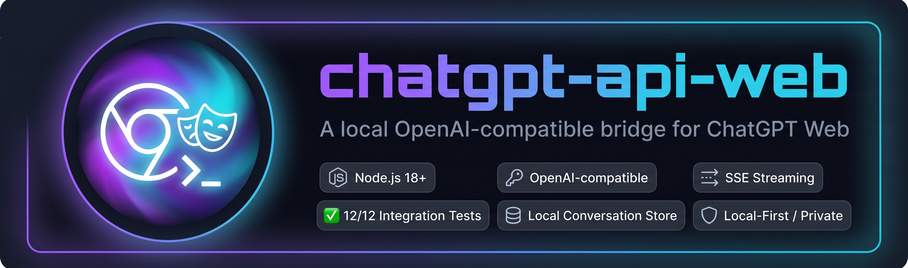

# chatgpt-api-web

<p align="center">
  
</p>

Hardened local OpenAI-compatible APIs backed by authenticated **ChatGPT Web** and **Mistral Web** sessions in dedicated Chrome profiles.

> These bridges automate web interfaces. They are **not** official OpenAI or Mistral API clients and inherit the account/session and UI-change risks of browser automation.

## Providers

| Provider | Start | Session init | API | CDP | State |
|---|---|---|---|---|---|
| ChatGPT | `npm start` / `npm run start:chatgpt` | `npm run init-session` | `127.0.0.1:3000` | `127.0.0.1:9222` | `data/` |
| Mistral | `npm run start:mistral` | `npm run init-session:mistral` | `127.0.0.1:3001` | `127.0.0.1:9223` | `data-mistral/` |

Both providers use the same hardened server, storage, logging, queue, authentication, validation, and browser-control implementation. Provider adapters only define the origin, conversation URL pattern, DOM selectors, and external conversation ID field.

- ChatGPT model ID: `chatgpt-web`; external conversation field: `chatgpt_id`
- Mistral model ID: `mistral-web`; external conversation field: `mistral_id`

## Security properties

- one dedicated persistent profile per provider;
- runtime profile/state directories ignored by Git;
- Chrome DevTools Protocol restricted to loopback;
- non-loopback API binds require a bearer token of at least 32 characters;
- timing-safe bearer-token comparison;
- DNS-rebinding-oriented `Host` validation;
- exact-origin CORS allowlist, never `*`;
- security response headers and no-store caching;
- bounded in-memory rate limiting and serialized queue admission;
- prompt content not logged by default;
- assistant responses not persisted by default;
- POSIX runtime directories `0700`, state/log files `0600`, and process umask `077`;
- atomic conversation-state writes with a last-known backup;
- provider navigation URLs restricted to the exact expected HTTPS origin/path;
- disconnected SSE clients attempt to cancel active generation;
- `/health` never starts a browser as a side effect;
- direct runtime dependencies limited to pinned Express and Playwright;
- patched `qs@6.16.0` forced through npm overrides;
- CI actions pinned to immutable commit SHAs.

## Requirements

- Node.js 20+
- npm
- Google Chrome
- a ChatGPT and/or Mistral account

Default Chrome paths:

| OS | Default |
|---|---|
| macOS | `/Applications/Google Chrome.app/Contents/MacOS/Google Chrome` |
| Windows | `C:\\Program Files\\Google\\Chrome\\Application\\chrome.exe` |
| Linux | `/usr/bin/google-chrome` |

Override with `CHROME_PATH` when required.

## Install

```bash
git clone https://github.com/mileadev/chatgpt-api-web.git
cd chatgpt-api-web
npm ci
cp .env.example .env
```

The application does not parse `.env` itself; export values through the shell/process manager or use your preferred environment loader.

Generate a bearer token:

```bash
export API_KEY="$(openssl rand -hex 32)"
```

An API key is optional only on loopback. It is still recommended on shared hosts.

## ChatGPT setup

Initialize the dedicated profile:

```bash
npm run init-session
```

Sign in to ChatGPT in the opened Chrome window, verify chat works, then press `Ctrl+C`.

Start the API:

```bash
npm start
```

Defaults:

```text
API     http://127.0.0.1:3000
CDP     http://127.0.0.1:9222
Profile data/chrome-profile/
State   data/conversations.json
```

## Mistral setup

Initialize its separate profile:

```bash
npm run init-session:mistral
```

Start the Mistral bridge:

```bash
npm run start:mistral
```

Defaults:

```text
API     http://127.0.0.1:3001
CDP     http://127.0.0.1:9223
Profile data-mistral/chrome-profile/
State   data-mistral/conversations.json
```

Provider-prefixed Mistral settings such as `MISTRAL_PORT`, `MISTRAL_CDP_PORT`, `MISTRAL_API_KEY`, and `MISTRAL_DATA_DIR` keep both providers isolated when run on the same host.

## OpenAI-compatible completion

ChatGPT example:

```bash
curl -sS \
  -X POST http://127.0.0.1:3000/v1/chat/completions \
  -H "Authorization: Bearer $API_KEY" \
  -H "Content-Type: application/json" \
  -d '{
    "model":"chatgpt-web",
    "messages":[{"role":"user","content":"Reply with exactly API_OK and nothing else."}]
  }'
```

Mistral uses the same schema at port `3001` with model `mistral-web`.

Responses include a local `conversation_id` plus either `chatgpt_id` or `mistral_id`.

## Streaming

Set `"stream": true` and use an SSE client such as `curl -N`. The bridge emits OpenAI-style chunks and ends with:

```text
data: [DONE]
```

If the client disconnects before completion, the provider adapter attempts to activate the visible stop-generation control.

## Conversation endpoints

```text
GET    /v1/conversations
GET    /v1/conversations/:id
PATCH  /v1/conversations/:id
DELETE /v1/conversations/:id
```

`DELETE` removes only the local mapping and closes its managed browser page. It does **not** delete the remote provider conversation.

## Health and metrics

Health is intentionally side-effect free:

```bash
curl http://127.0.0.1:3000/health
curl http://127.0.0.1:3001/health
```

HTTP `200` means that provider's loopback CDP endpoint is reachable; `503` means degraded/unavailable.

Metrics require the same bearer authentication as `/v1` when a key is configured:

```bash
curl -H "Authorization: Bearer $API_KEY" http://127.0.0.1:3000/metrics
```

## Network controls

Safe defaults:

```env
HOST=127.0.0.1
CDP_HOST=127.0.0.1
MISTRAL_HOST=127.0.0.1
MISTRAL_CDP_HOST=127.0.0.1
```

CDP hosts must remain loopback. A non-loopback HTTP bind fails startup unless the applicable API key is at least 32 characters.

Browser requests with an `Origin` header are denied unless the exact origin appears in `ALLOWED_ORIGINS` or `MISTRAL_ALLOWED_ORIGINS`. Native clients without `Origin` continue to work.

When loopback-bound, `Host` must also be `localhost`, `127.0.0.1`, or `::1`, unless explicitly added to the applicable allowed-host list.

## Privacy defaults

```env
LOG_PROMPT_CONTENT=false
STORE_LAST_RESPONSE=false
LOG_TO_FILE=false
```

Turning these on intentionally increases locally retained sensitive data.

## Queue and rate controls

```env
RATE_LIMIT_MAX=60
RATE_LIMIT_WINDOW_MS=60000
MAX_QUEUE_DEPTH=20
MAX_CONVERSATIONS=250
```

Provider browser operations are serialized because DOM automation is stateful. The bounded queue prevents an unbounded backlog.

## Tests

Deterministic syntax/security/storage/provider-adapter checks:

```bash
npm test
```

Live integration testing is provider-neutral. Point `API_URL` at the desired running service:

```bash
# ChatGPT
API_URL=http://127.0.0.1:3000 API_KEY="$API_KEY" npm run test:integration

# Mistral
API_URL=http://127.0.0.1:3001 MISTRAL_API_KEY="$MISTRAL_API_KEY" npm run test:integration
```

The suite discovers the provider model automatically and validates health, completions, local/external conversation continuity, metadata operations, SSE, input validation, and cleanup.

Compatibility probe:

```bash
API_URL=http://127.0.0.1:3000 API_KEY="$API_KEY" npm run test:openai
```

## Dependency and CI policy

Runtime dependencies are intentionally limited to:

- `express@5.2.1`
- `playwright@1.62.1`

`qs@6.16.0` is forced as a patched transitive version. The lockfile is committed and CI uses `npm ci --ignore-scripts` before `npm test` and `npm audit --omit=dev --audit-level=high` on Node 20 and 22. Dependabot checks npm dependencies weekly. Third-party workflow actions are pinned to immutable commit SHAs.

Playwright 1.63.0 was released on September 4, 2026; this repository intentionally keeps the previously validated 1.62.1 baseline for this browser-automation workload and lets Dependabot stage upgrades for review rather than silently moving the automation engine.

## Operational recommendations

1. use dedicated provider profiles created by the supplied initialization commands;
2. keep HTTP and CDP listeners on loopback whenever possible;
3. configure API keys even locally on multi-user systems;
4. do not expose either server directly to the public Internet;
5. for remote access, combine bearer auth with an authenticated network layer or reverse proxy;
6. avoid centralized prompt logging unless data classification explicitly permits it;
7. monitor dependency alerts and provider UI changes;
8. revoke the affected provider session immediately if a profile is exposed.

See [SECURITY.md](SECURITY.md) for exposure-response guidance.

## Limitations

- ChatGPT or Mistral DOM changes can break selectors without notice.
- System messages are emulated as text prepended to the browser prompt; they are not equivalent to official API system roles.
- Token usage is unavailable from the DOM bridge, so `usage` is `null`.
- SSE cannot retract already-emitted text if a provider rewrites an existing streamed DOM segment.
- The model IDs describe the web bridge, not an independently selectable official provider model/API SKU.
- Each process controls an authenticated browser profile and should be treated as a privileged local service.

## Attribution

Based on the original `MrBalourd/chatgpt-api-web` project by Enzo Desvaux. The original MIT license is retained.

## License

MIT. See [LICENSE](LICENSE).
